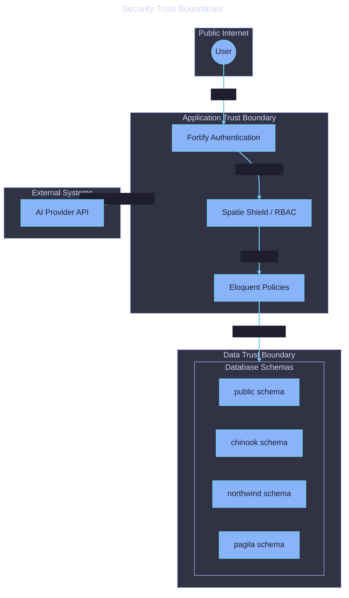
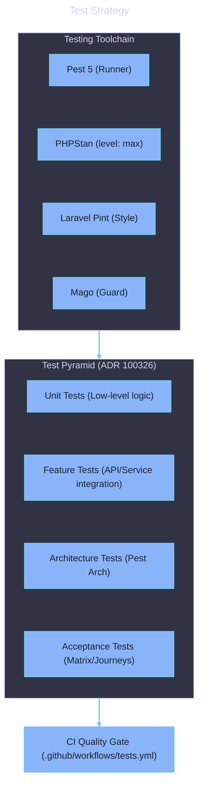

# Non-functional Requirements

  

    Expand for Table of Contents
  

- [1. Purpose](#1-purpose)
- [2. Requirement Identifiers](#2-requirement-identifiers)
- [3. Non-functional Requirements](#3-non-functional-requirements)
    - [3.1. NFR-1: Reliability \& Durability](#31-nfr-1-reliability--durability)
    - [3.2. NFR-2: Performance \& Scalability](#32-nfr-2-performance--scalability)
    - [3.3. NFR-3: Security \& Compliance](#33-nfr-3-security--compliance)
    - [3.4. NFR-4: Maintainability \& Quality](#34-nfr-4-maintainability--quality)
- [4. Diagrams](#4-diagrams)

---

## 1. Purpose

This document specifies the quality attributes, constraints, and operational requirements for the Samples project.

## 2. Requirement Identifiers

- `NFR-1.x`: Reliability & Durability
- `NFR-2.x`: Performance & Scalability
- `NFR-3.x`: Security & Compliance
- `NFR-4.x`: Maintainability & Quality

## 3. Non-functional Requirements

### 3.1. NFR-1: Reliability & Durability

- **NFR-1.1:** The system shall use PostgreSQL 18 with native UUIDv7 for all primary keys to ensure global uniqueness and sortability.
- **NFR-1.2:** The import pipeline shall be idempotent and support resumption after failure.
- **NFR-1.3:** Database integrity shall be maintained via schema-level constraints and foreign keys within product domains.

### 3.2. NFR-2: Performance & Scalability

- **NFR-2.1:** The system shall use PostgreSQL Full Text Search (TSV) and pgvector HNSW indexes for sub-second search latency.
- **NFR-2.2:** Vector embeddings shall be generated asynchronously via Laravel Queues to avoid blocking the main request cycle.
- **NFR-2.3:** The portfolio snapshots shall use materialized views or optimized snapshots for fast administrative overviews.

### 3.3. NFR-3: Security & Compliance

- **NFR-3.1:** All product-specific data shall be isolated in dedicated PostgreSQL schemas to prevent cross-domain leakage.
- **NFR-3.2:** The system shall enforce a strict "Team Membership" middleware for all authenticated routes.
- **NFR-3.3:** Passwords shall be hashed using Argon2id, and MFA shall be available for all users.

### 3.4. NFR-4: Maintainability & Quality

- **NFR-4.1:** The codebase shall maintain zero PHPStan errors at `level: max`.
- **NFR-4.2:** The test suite shall achieve a minimum of 80% line coverage (ratcheting from 25%).
- **NFR-4.3:** All architectural decisions shall be documented as ADRs and cross-referenced in the dossier.

## 4. Diagrams

[Security Trust Boundaries](../assets/security-trust-boundaries.mmd)

[Test Strategy](../assets/test-strategy.mmd)

