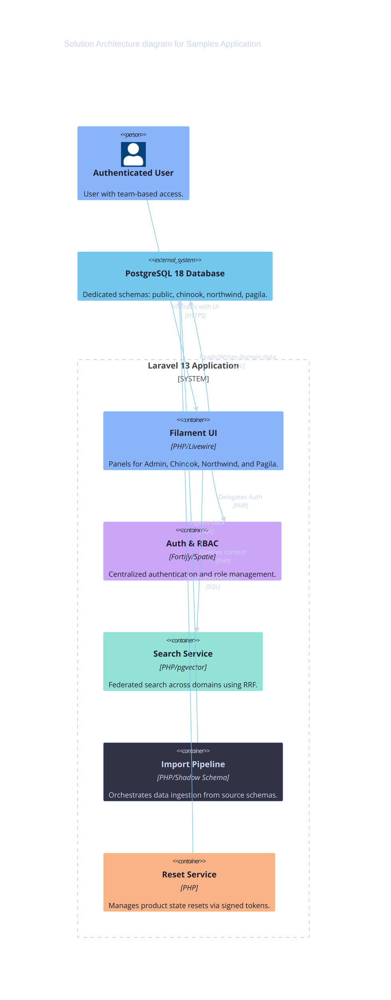

# Solution Architecture

<details>
  <summary style="font-size: 1.25em; font-weight: bold; margin: 0.83em 0; cursor: pointer;">
    Expand for Table of Contents
  </summary>

- [1. Purpose](#1-purpose)
- [2. Container Architecture](#2-container-architecture)
- [3. Data Flows](#3-data-flows)
    - [3.1. Search Request Flow](#31-search-request-flow)
    - [3.2. Data Ingestion Flow](#32-data-ingestion-flow)
- [4. Deployment Pattern](#4-deployment-pattern)
- [5. Diagrams](#5-diagrams)

</details>

---

## 1. Purpose

This document describes the internal structure of the Samples application, its core components, data flows, and deployment patterns.

## 2. Container Architecture

The application is structured into several functional containers:

- **Filament UI:** Provides the administrative and product-specific dashboards using Livewire and Alpine.js.
- **Auth & RBAC:** Manages identity via Fortify and permissions via Spatie Shield.
- **Search Infrastructure:** Orchestrates federated search across product schemas using RRF and pgvector.
- **Product Lifecycle Services:** Handles data ingestion (Import Pipeline) and state management (Reset Workflow).

## 3. Data Flows

### 3.1. Search Request Flow

1. User enters a query in the Filament Search interface.
2. `FederatedSearchService` triggers parallel queries against `chinook.search_projections`, `northwind.search_projections`, and `pagila.search_projections`.
3. Results are combined and re-ranked via `ReciprocalRankFusion`.
4. The user receives a unified list of deep links.

### 3.2. Data Ingestion Flow

1. Operator triggers an import via CLI or UI.
2. `ProductImportPipeline` reads from source shadow schemas or files.
3. Records are transformed and written to the product schema with UUIDv7 primary keys.
4. `SourceIdentityRegistry` captures the mapping for traceability.
5. Observers trigger `EmbeddingJob` for vector search projection updates.

## 4. Deployment Pattern

The application targets a containerized or VM-based stack:

- **Web Layer:** Nginx + PHP-FPM 8.5.
- **Worker Layer:** Laravel Queue Workers for embedding and import tasks.
- **Data Layer:** PostgreSQL 18 with per-product schemas.

## 5. Diagrams

[Solution Architecture Diagram](../assets/solution-architecture.mmd)



<br />

[Deployment Architecture Diagram](../assets/deployment-architecture.mmd)

````mermaid
---
title: Deployment Architecture
config:
  theme: redux-dark-color
  themeVariables:
    background: "#1e1e2e"
    primaryColor: "#89b4fa"
    primaryTextColor: "#1e1e2e"
    primaryBorderColor: "#74c7ec"
    lineColor: "#74c7ec"
    secondaryColor: "#cba6f7"
    secondaryTextColor: "#1e1e2e"
    secondaryBorderColor: "#b4befe"
    tertiaryColor: "#94e2d5"
    tertiaryTextColor: "#1e1e2e"
    tertiaryBorderColor: "#89dceb"
    mainBkg: "#89b4fa"
    secondBkg: "#cba6f7"
    tertiaryBkg: "#94e2d5"
    textColor: "#cdd6f4"
    nodeBorder: "#74c7ec"
    clusterBkg: "#313244"
    clusterBorder: "#b4befe"
    edgeLabelBackground: "#1e1e2e"
    titleColor: "#cdd6f4"
    fontSize: 16px
  themeCSS: |
    .node rect, .node circle, .node ellipse, .node polygon, .node path { stroke-width: 2px !important; }
    .edgePath .path { stroke-width: 2px !important; }
    .label { font-weight: bold !important; }
    .edgeLabel { background-color: #1e1e2e !important; }
---
flowchart TD
    subgraph Client["Client Tier"]
        Browser["User Browser<br/>(Chrome/Firefox/Safari)"]
    end

    subgraph AppServer["Application Tier (Laravel 13)"]
        Web["Web Server<br/>(Nginx/Apache)"]
        PHP["PHP 8.5 Runtime<br/>(FPM)"]
        Queue["Queue Worker<br/>(Embedding Jobs)"]
    end

    subgraph DataTier["Data Tier (PostgreSQL 18)"]
        DB[(PostgreSQL DB)]
        subgraph Schemas["Schemas"]
            Pub[public]
            Chi[chinook]
            Nor[northwind]
            Pag[pagila]
        end
        DB --- Schemas
    end

    subgraph External["External Services"]
        AI["AI Provider<br/>(Gemini/OpenAI)"]
    end

    Browser -->|HTTPS| Web
    Web --> PHP
    PHP -->|SQL| DB
    PHP -->|Jobs| Queue
    Queue -->|SQL| DB
    Queue -->|API| AI```
````
