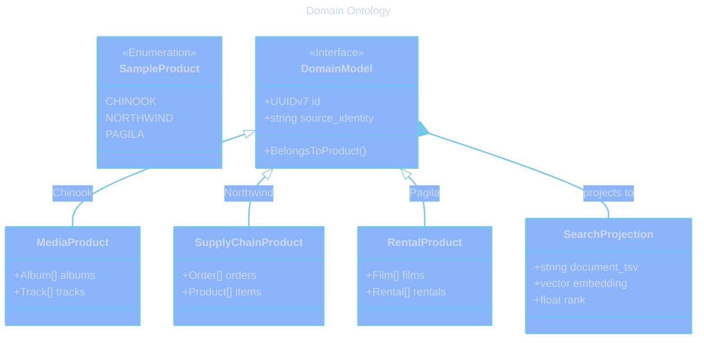

# Domain Ontology

  

    Expand for Table of Contents
  

- [1. Purpose](#1-purpose)
- [2. Core Concepts](#2-core-concepts)
    - [2.1. Product Domain](#21-product-domain)
    - [2.2. Sample Entity](#22-sample-entity)
    - [2.3. Team & Membership](#23-team-membership)
- [3. Relationships](#3-relationships)
- [4. Competency Questions](#4-competency-questions)
- [5. Diagrams](#5-diagrams)

---

## 1. Purpose

This document defines the core concepts and entities within the Samples domain, representing the conceptual model of the application independently of the physical implementation.

## 2. Core Concepts

### 2.1. Product Domain

A top-level classification of reference data. The system currently recognizes three domains:

- **Media (Chinook):** Concepts related to music, artists, albums, and digital media sales.
- **Supply Chain (Northwind):** Concepts related to products, suppliers, customers, and orders.
- **Rental (Pagila):** Concepts related to films, actors, stores, and DVD rentals.

### 2.2. Sample Entity

Any record within a product domain that represents a reference data point. All Sample Entities share common characteristics:

- **Global Identity:** A UUIDv7 identifier unique across the entire system.
- **Source Traceability:** A mapping back to the original identity in the reference dataset.
- **Searchability:** A projection into the federated search index.

### 2.3. Team & Membership

The organizational unit for user access. A Team owns Artefacts and defines the boundary for user collaboration within panels.

## 3. Relationships

- A **Team** can access multiple **Product Domains**.
- A **User** belongs to a **Team** via **Membership**.
- An **Operator** manages all **Product Domains**.
- A **Curator** manages a specific **Product Domain**.
- **Sample Entities** are grouped into **Product Domains** based on their schema location.

## 4. Competency Questions

- Which product domain does this record belong to?
- Who is the curator responsible for this specific album?
- What was the original ID of this customer in the Northwind CSV file?
- Which teams have access to the Pagila rental panel?

## 5. Diagrams

[Domain Ontology](../assets/domain-ontology.mmd)

