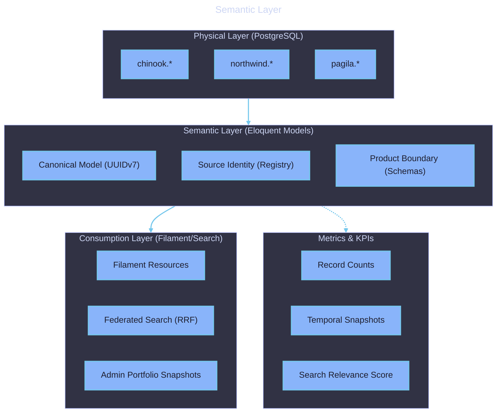

# Semantic Layer

  

    Expand for Table of Contents
  

- [1. Purpose](#1-purpose)
- [2. Semantic Mappings](#2-semantic-mappings)
    - [2.1. Physical to Canonical Mapping](#21-physical-to-canonical-mapping)
    - [2.2. Search Projection Semantics](#22-search-projection-semantics)
- [3. Metrics \& KPIs](#3-metrics--kpis)
- [4. Access Control \& Governance](#4-access-control--governance)
- [5. Consumption](#5-consumption)
- [6. Diagrams](#6-diagrams)

---

## 1. Purpose

This document describes the semantic layer of the Samples application, detailing how physical data is operationalized, mapped, and consumed as canonical business concepts.

## 2. Semantic Mappings

The semantic layer bridges the gap between the physical PostgreSQL schemas and the business logic in Laravel.

### 2.1. Physical to Canonical Mapping

- **Physical:** `chinook.artists.ArtistId` (Integer)
- **Canonical:** `App\Models\Chinook\Artist->id` (UUIDv7)
- **Transformation:** During the import phase, the `ChinookImporter` generates a UUIDv7 and records the original ID in the `source_identities` registry.

### 2.2. Search Projection Semantics

Each domain model is projected into a searchable document format:

- **Dimensions:** Product Domain, Resource Type.
- **Measures:** Record Relevance (weighted TSV + Vector distance).
- **Transformation:** The `SearchProjection` model concatenates key attributes (name, description, tags) into a `document_tsv` and a high-dimensional `embedding`.

## 3. Metrics & KPIs

The semantic layer provides the following canonical metrics:

- **Product Health:** Record counts vs. expected baseline (via `PortfolioSnapshotStats`).
- **Search Quality:** Mean Reciprocal Rank (MRR) of search results (Planned).
- **Import Velocity:** Records ingested per second during pipeline execution.

## 4. Access Control & Governance

Access to the semantic layer is governed by:

- **Eloquent Policies:** Scoping queries to the current user's team and role.
- **Filament Resources:** Defining the visible "projection" of the domain models to the end-user.

## 5. Consumption

- **APIs:** The `FederatedSearchService` consumes the semantic projections to provide cross-domain results.
- **UI:** Filament panels consume Eloquent models, providing a curated view of the underlying schemas.

## 6. Diagrams

[Semantic Layer](../assets/semantic-layer.mmd)

