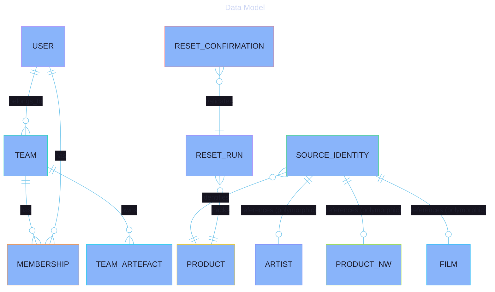

# Data Model

<details>
  <summary style="font-size: 1.25em; font-weight: bold; margin: 0.83em 0; cursor: pointer;">
    Expand for Table of Contents
  </summary>

- [1. Purpose](#1-purpose)
- [2. Physical Schema Isolation](#2-physical-schema-isolation)
    - [2.1. public Schema](#21-public-schema)
    - [2.2. chinook, northwind, pagila Schemas](#22-chinook-northwind-pagila-schemas)
- [3. Key Strategy (UUIDv7)](#3-key-strategy-uuidv7)
- [4. Search Projections](#4-search-projections)
- [5. Relationships](#5-relationships)
- [6. Diagrams](#6-diagrams)
    - [6.1. The connected model is in [`data-model.mmd`](../assets/data-model.mmd).](#61-the-connected-model-is-in-data-modelmmdassetsdata-modelmmd)
    - [6.2. While standalone product entities are in [`data-model-unconnected.mmd`](../assets/data-model-unconnected.mmd).](#62-while-standalone-product-entities-are-in-data-model-unconnectedmmdassetsdata-model-unconnectedmmd)
    - [6.3. Reset Run Lifecycle](#63-reset-run-lifecycle)

</details>

---

## 1. Purpose

This document describes the physical data model of the Samples application, including schema isolation, key strategies, and entity relationships.

## 2. Physical Schema Isolation

The project uses a single PostgreSQL 18 instance with multiple schemas to enforce domain isolation.

### 2.1. public Schema

Contains shared application infrastructure:

- `users`, `teams`, `memberships`: Identity and access management.
- `source_identities`: Traceability registry for all imported records.
- `reset_runs`, `reset_confirmations`: State machine for product resets.
- `team_artefacts`: Polymorphic storage for team-owned objects.
- `activity_log`, `permissions`, `roles`: Audit and RBAC.

### 2.2. chinook, northwind, pagila Schemas

Contain product-specific reference data. Each schema is independent and contains its own set of tables (e.g., `chinook.artists`, `northwind.orders`).

## 3. Key Strategy (UUIDv7)

Following **ADR 0002**, all primary keys in the application use **UUIDv7**.

- **Benefits:** Global uniqueness across schemas, lexicographical sortability by time, and native support in PostgreSQL 18.
- **Implementation:** Primary keys are defined as `uuid` columns in migrations and use Laravel's `HasUuids` trait.

## 4. Search Projections

Each product schema contains a `search_projections` table:

- **Columns:** `id` (UUIDv7), `entity` (string), `document_tsv` (tsvector), `embedding` (vector(1024)), `embedding_state` (enum).
- **Triggers:** Generated columns for `document_tsv` ensure text search data is always in sync with product attributes.

## 5. Relationships

- **Polymorphic:** `source_identities` relates to product models via a string-based `entity` and `source_key`.
- **Cross-schema:** Eloquent models use the `#[Table]` attribute to specify the schema-qualified table name (e.g., `chinook.albums`).

## 6. Diagrams

The diagrams are split because Mermaid treats a standalone `.mmd` file as one
diagram definition.

### 6.1. The connected model is in [`data-model.mmd`](../assets/data-model.mmd).



### 6.2. While standalone product entities are in [`data-model-unconnected.mmd`](../assets/data-model-unconnected.mmd).

```mermaid
---
title: Unconnected Product Entities
config:
  theme: redux-dark-color
  themeVariables:
    background: "#1e1e2e"
    primaryColor: "#89b4fa"
    primaryTextColor: "#1e1e2e"
    primaryBorderColor: "#74c7ec"
    lineColor: "#74c7ec"
    secondaryColor: "#cba6f7"
    secondaryTextColor: "#1e1e2e"
    secondaryBorderColor: "#b4befe"
    tertiaryColor: "#94e2d5"
    tertiaryTextColor: "#1e1e2e"
    tertiaryBorderColor: "#89dceb"
    mainBkg: "#89b4fa"
    secondBkg: "#cba6f7"
    tertiaryBkg: "#94e2d5"
    textColor: "#cdd6f4"
    nodeBorder: "#74c7ec"
    clusterBkg: "#313244"
    clusterBorder: "#b4befe"
    edgeLabelBackground: "#1e1e2e"
    titleColor: "#cdd6f4"
    fontSize: 16px
    erEdgeLabelBackground: "#1e1e2e"
    relationColor: "#74c7ec"
    relationLabelBackground: "#1e1e2e"
    relationLabelColor: "#cdd6f4"
  themeCSS: |
    .node rect, .node circle, .node ellipse, .node polygon, .node path { stroke-width: 2px !important; }
    .edgePath .path { stroke-width: 2px !important; }
    .label { font-weight: bold !important; }
    .edgeLabel { background-color: #1e1e2e !important; }
  er:
    layoutDirection: TB
    defaultRenderer: elk
    minEntityWidth: 90
    nodeSpacing: 10
    rankSpacing: 120
---
erDiagram
    direction TB

    %% chinook_schema
    ALBUM
    TRACK
    CUSTOMER
    INVOICE

    %% northwind_schema
    CATEGORY
    SUPPLIER
    ORDER
    EMPLOYEE

    %% pagila_schema
    ACTOR
    RENTAL
    STORE
    STAFF
```



### 6.3. Reset Run Lifecycle

[Reset Run Lifecycle Diagram](../assets/state-reset-run.mmd)

````mermaid
---
title: Diagram
config:
  theme: redux-dark-color
  themeVariables:
    background: "#1e1e2e"
    primaryColor: "#89b4fa"
    primaryTextColor: "#1e1e2e"
    primaryBorderColor: "#74c7ec"
    lineColor: "#74c7ec"
    secondaryColor: "#cba6f7"
    secondaryTextColor: "#1e1e2e"
    secondaryBorderColor: "#b4befe"
    tertiaryColor: "#94e2d5"
    tertiaryTextColor: "#1e1e2e"
    tertiaryBorderColor: "#89dceb"
    mainBkg: "#89b4fa"
    secondBkg: "#cba6f7"
    tertiaryBkg: "#94e2d5"
    textColor: "#cdd6f4"
    nodeBorder: "#74c7ec"
    clusterBkg: "#313244"
    clusterBorder: "#b4befe"
    edgeLabelBackground: "#1e1e2e"
    titleColor: "#cdd6f4"
    fontSize: 16px
  themeCSS: |
    .node rect, .node circle, .node ellipse, .node polygon, .node path { stroke-width: 2px !important; }
    .edgePath .path { stroke-width: 2px !important; }
    .label { font-weight: bold !important; }
    .edgeLabel { background-color: #1e1e2e !important; }
---
stateDiagram-v2
    [*] --> Pending: Token Generated
    Pending --> Running: Token Confirmed
    Running --> Completed: Pipeline Success
    Running --> Failed: Pipeline Error
    Completed --> [*]
    Failed --> [*]```
````
