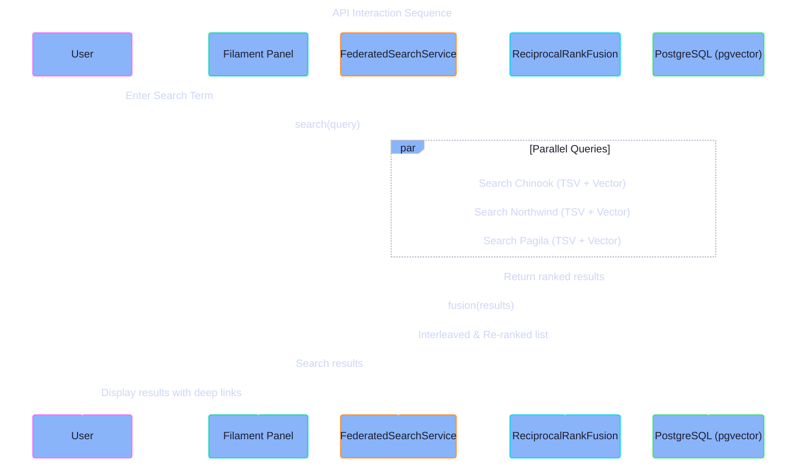

# API Specification

  

    Expand for Table of Contents
  

- [1. Purpose](#1-purpose)
- [2. Search Service Contract](#2-search-service-contract)
    - [2.1. `search(string $query): Collection`](#21-searchstring-query-collection)
- [3. Import Pipeline Contract](#3-import-pipeline-contract)
    - [3.1. `import(string $product): void`](#31-importstring-product-void)
- [4. Product Reset Contract](#4-product-reset-contract)
    - [4.1. `open(string $product): string`](#41-openstring-product-string)
    - [4.2. `confirm(string $token): void`](#42-confirmstring-token-void)
- [5. Diagrams](#5-diagrams)

---

## 1. Purpose

This document defines the internal API and service contracts used by the Samples application, focusing on search, import, and reset interactions.

## 2. Search Service Contract

The `FederatedSearchService` provides the primary interface for cross-domain discovery.

### 2.1. `search(string $query): Collection`

- **Input:** Natural language search string.
- **Process:**
    1. Generates a temporary embedding for the query.
    2. Executes parallel queries against `search_projections` in all product schemas.
    3. Combines TSV (BM25-like) and Vector (Cosine similarity) ranks.
    4. Applies `ReciprocalRankFusion` to interleave results.
- **Output:** A collection of `SearchResult` objects containing the entity type, UUID, and relevance score.

## 3. Import Pipeline Contract

The `ProductImportPipeline` manages the ingestion of reference data.

### 3.1. `import(string $product): void`

- **Input:** Product name (chinook, northwind, or pagila).
- **Process:**
    1. Identifies the source files/schemas.
    2. Truncates the target product schema.
    3. Maps source records to UUIDv7 entities.
    4. Populates the `source_identities` registry.
    5. Dispatches `EmbeddingJob` for all new records.

## 4. Product Reset Contract

The `ResetWindow` and `ResetConfirmationService` manage state-safe resets.

### 4.1. `open(string $product): string`

- **Process:** Generates a signed reset token and creates a `reset_runs` entry with status `pending`.
- **Output:** The signed confirmation token.

### 4.2. `confirm(string $token): void`

- **Process:** Validates the token and transitions the `reset_runs` status to `running`, triggering the `ProductImportPipeline`.

## 5. Diagrams

[API Interaction Sequence](../assets/api-interaction-sequence.mmd)

