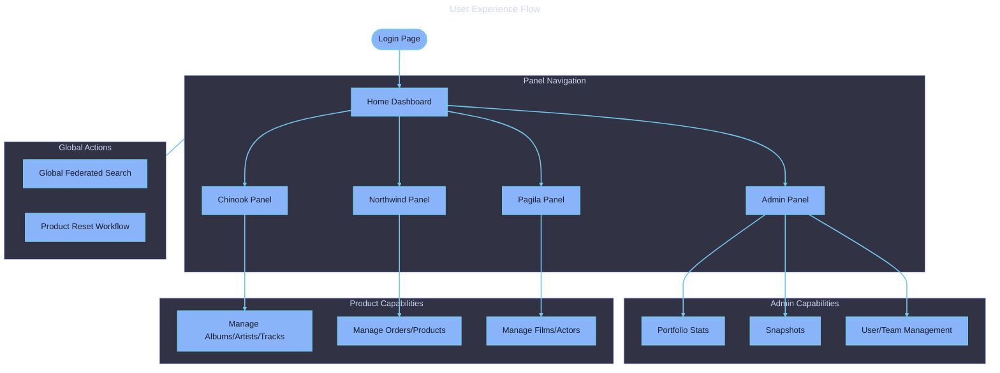

# UX Design

  

    Expand for Table of Contents
  

- [1. Purpose](#1-purpose)
- [2. Design Principles](#2-design-principles)
- [3. Navigation Patterns](#3-navigation-patterns)
    - [3.1. Dashboard](#31-dashboard)
    - [3.2. Filament Panels](#32-filament-panels)
    - [3.3. Federated Search UI](#33-federated-search-ui)
- [4. Key UX Flows](#4-key-ux-flows)
    - [4.1. Cross-Product Discovery](#41-cross-product-discovery)
    - [4.2. Product State Management](#42-product-state-management)
- [5. Diagrams](#5-diagrams)

---

## 1. Purpose

This document describes the user experience principles, navigation patterns, and panel structures of the Samples application.

## 2. Design Principles

- **Isolation by Default:** Each product domain has its own visual boundary (Panel) to avoid user confusion between heterogeneous datasets.
- **Shared Infrastructure:** Common tasks like login, search, and profile management use consistent patterns across all panels.
- **Administrative Oversight:** The Admin panel provides a "God-eye" view of all product domains without merging their data.

## 3. Navigation Patterns

### 3.1. Dashboard

The root dashboard serves as the central hub, providing entry points to the Admin, Chinook, Northwind, and Pagila panels.

### 3.2. Filament Panels

Each product panel is a dedicated Filament instance:

- **Chinook:** Blue theme, music-focused icons.
- **Northwind:** Green theme, industrial icons.
- **Pagila:** Purple theme, media/entertainment icons.
- **Admin:** Gray/Slate theme, administrative icons.

### 3.3. Federated Search UI

The global search interface provides a unified results list. Each result includes a badge indicating its product domain and a direct link to the record's resource page.

## 4. Key UX Flows

### 4.1. Cross-Product Discovery

1. User activates search from any panel.
2. Results display matches from all three products.
3. Clicking a result navigates the user to the specific panel and resource for that record.

### 4.2. Product State Management

1. Operator visits the Admin Portfolio.
2. Identifies a product that needs resetting.
3. Triggers the reset workflow, which provides clear visual feedback of the "Resetting" state.

## 5. Diagrams

[UX Flow](../assets/ux-flow.mmd)

